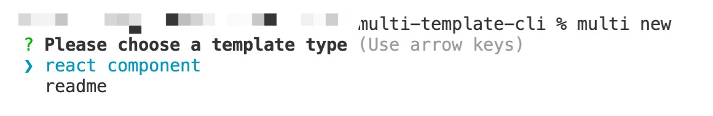
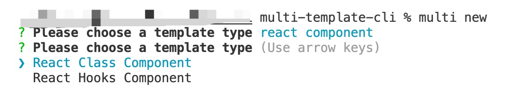
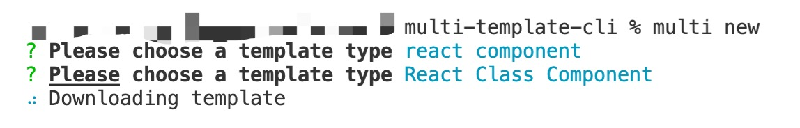

# multi-template-cli

> A cli tool using for create templates such as React Component Templates, readme file of NPM

> 一个用于生成 React Component 模板、NPM 包 readme 等常用文件模板的 cli 工具

## Install 安装

```
$ npm install -g multi-template-cli
```

## Usage 使用方法

```
multi new
```

## Demo 效果演示







## Author 作者

github: https://github.com/potato-carrot

email: haotianhan@126.com
